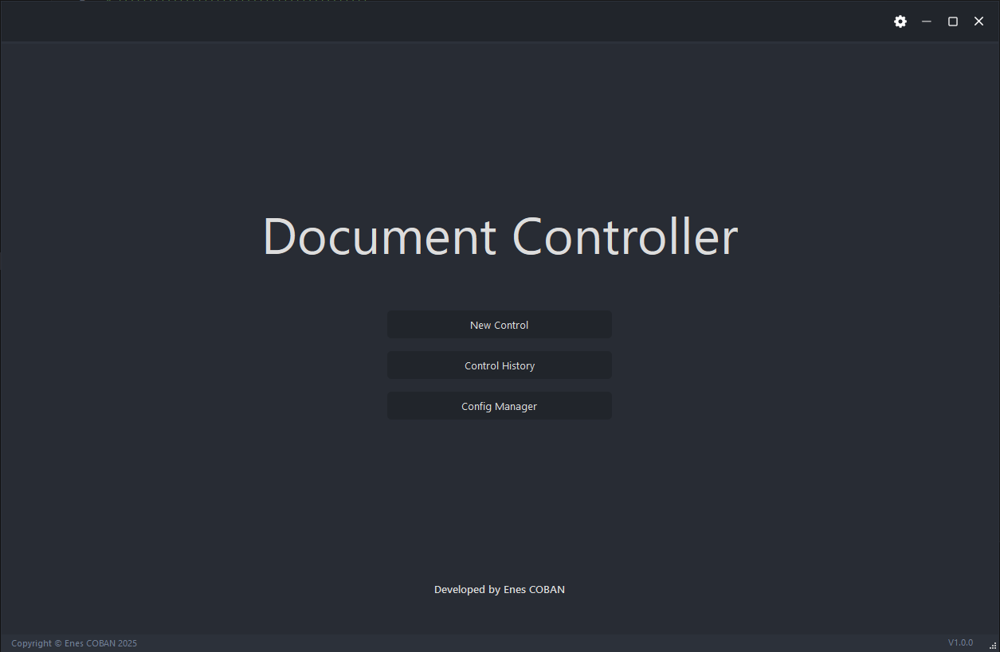
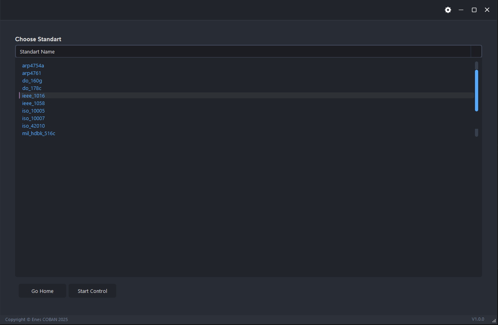
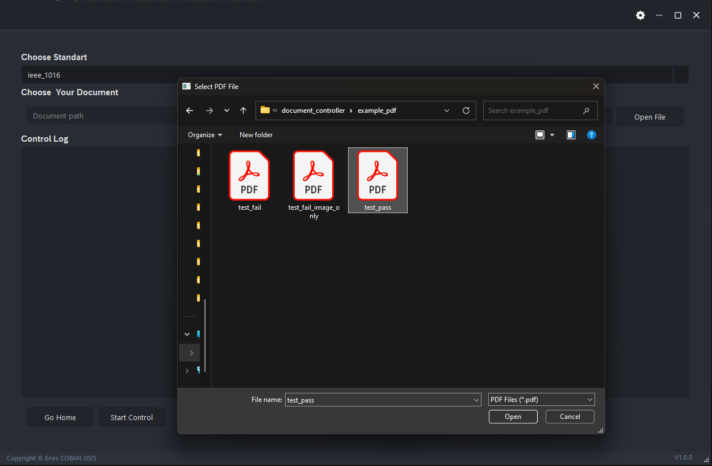
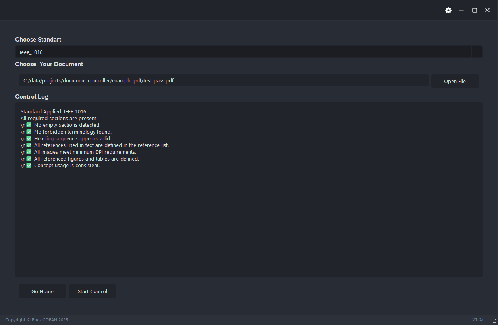
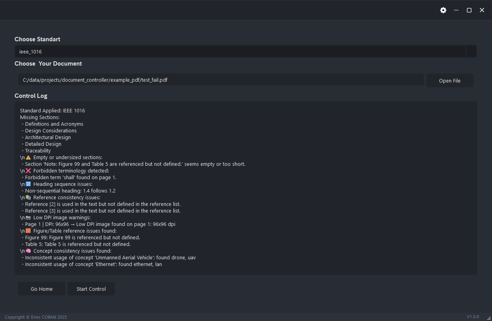

# 📄 Document Compliance Controller

A powerful and extensible desktop tool for validating technical documents (e.g., SDDs, ARPs, STDs) against professional standards such as IEEE 1016, DO-178C, MIL-STD-498, ISO 10007, and others.

Built with **Python 3.10+** and **PyQt6**, the system analyzes PDF documents and detects structural, stylistic, semantic, and graphical inconsistencies based on modular YAML configurations.

---

## 🚀 Features

- 🖥️ GUI built with PyQt6
- 📂 Load PDF documents from file browser
- 🎯 Select standard config from dropdown (`configs/`)
- 🔍 Check document for:
  - Required section presence
  - Empty or undersized sections
  - Heading sequence order (e.g., 1.2 → 1.4)
  - Forbidden terminology (e.g., “shall”)
  - Figure/table cross-reference mismatch
  - DPI quality of embedded images
  - Reference consistency (e.g., [2] is used but not defined)
  - Concept consistency (e.g., “UAV” vs “drone”)

---

## 🧰 Project Structure

```
DOCUMENT_CONTROLLER/
├── configs/                  # YAML config files per standard
├── example_pdf/              # Sample documents for testing
├── icons/                    # Icons used by the UI
├── modules/                  # Core Python logic
│   └── controllers/          # All checking logic (modular)
│       ├── concept_consistency_controller.py
│       ├── empty_section_controller.py
│       ├── figure_table_controller.py
│       ├── heading_sequence_controller.py
│       ├── image_quality_controller.py
│       ├── reference_consistency_controller.py
│       └── terminology_controller.py
│   ├── config_loader.py
│   ├── document_parser.py
│   ├── report_generator.py
│   └── rules_engine.py
├── tests/                    # Optional: test cases or automation
├── ui/                       # UI logic and QtDesigner files
│   ├── app_settings.py
│   ├── custom_grips.py
│   ├── main.ui               # Designed interface (QtDesigner)
│   ├── resources.qrc/rc.py
│   ├── ui_functions.py
│   └── ui_main.py
├── main.py                   # Entry point with QApplication
├── README.md
└── requirements.txt
```

---

## 📦 Installation

```bash
pip install -r requirements.txt
python main.py
```

> Requires Python 3.10+ and Windows/macOS/Linux with GUI support.

---

## 🧠 YAML Configuration

Each file in `configs/` defines rules such as:

```yaml
standard_name: IEEE 1016
required_sections:
  - Introduction
  - Design Considerations
terminology_rules:
  forbidden_words: ["shall", "must"]
  preferred_words: ["should", "may"]
concept_groups:
  Ethernet:
    - ethernet
    - rj45
```

You can easily add your own `.yaml` files to validate custom documentation formats.

---

## 📂 Example Documents

Under `example_pdf/`, you’ll find:
- ✅ `test_pass.pdf` – passes all checks
- ❌ `test_fail.pdf` – contains multiple structured errors
- 🖼 `test_fail_image_only.pdf` – fails DPI/image validation

Use them to validate your integration or test new standards.

---

## 📃 License

MIT License – Free to use, modify, and distribute.

---

## 👨‍💻 Author

Developed by **Enes Çoban**

This tool is designed to assist in documentation quality validation for engineering, aerospace, defense, and compliance-critical domains.

## 🖼 Example Screenshots

Below are key screenshots demonstrating the GUI and control flow of the application:

### 1. Home Screen


### 2. Standard Selection View


### 3. File Dialog for PDF Selection


### 4. Control Log – All Checks Passed


### 5. Control Log – Fail Example
